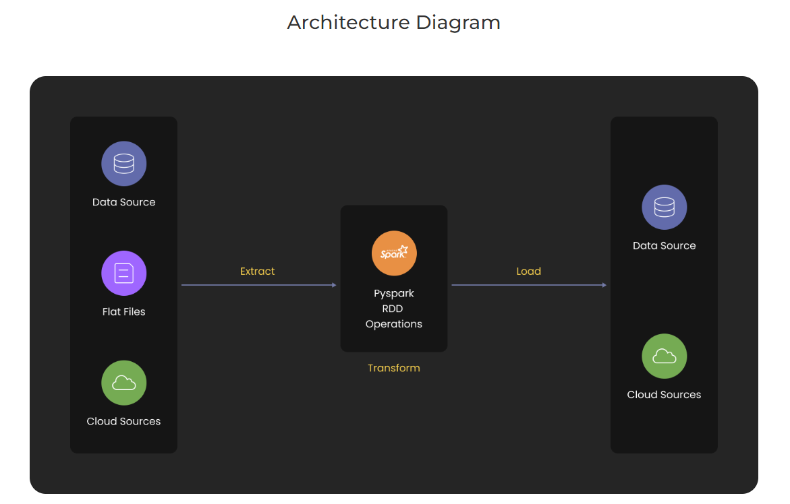
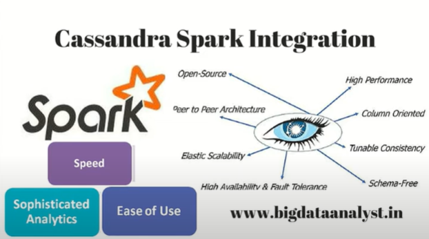

# PySpark-Project-1
PySpark ETL Project - Build a Data Pipeline using Hive and Cassandra

## Project Description

### Overview
This project mainly focuses on integrating PySpark with Apache Cassandra and Apache Hive to perform ETL(Extract-Transform-Load) and ELT(Extract-Load-Transform) operations.
 
 ## Architecture

## Tech stack:  

➔Language: Python

➔Package: PySpark

➔Services: AWS EC2, Docker, Apache Cassandra, Hive

## AWS EC2
Amazon EC2 instance is a virtual server on Amazon's Elastic Compute Cloud (EC2) for executing applications on the Amazon Web Services (AWS) architecture. Corporate customers can use the Amazon Elastic Compute Cloud (EC2) service to run applications in a computer environment. Amazon EC2 eliminates the requirement for upfront hardware investment, allowing customers to design and deploy projects quickly. Users can launch as many or as few virtual servers as they like, configure security and networking, and manage storage on Amazon EC2.

## Docker
Docker is a free and open-source containerization platform, and it enables programmers to package programs into containers. These standardized executable components combine application source code with the libraries and dependencies required to run that code in any environment.

## Apache Cassandra
Apache Cassandra is a distributed data storage system that is free and open-source. It is a column-oriented database. It is fault-tolerant and scalable. Its design enables users to respond to abrupt spikes in demand by allowing them to simply add extra hardware to accommodate more customers and data. Cassandra can handle organized, semi-structured, and unstructured data, allowing users to store data in a variety of ways. Cassandra employs numerous data centers to facilitate data delivery wherever and wherever it is required. Cassandra supports the ACID properties of atomicity, consistency, isolation, and durability.

## Hive
Apache Hive is a fault-tolerant distributed data warehouse that allows for massive-scale analytics. Using SQL, Hive will enable users to read, write, and manage petabytes of data. Hive is built on top of Apache Hadoop, an open-source platform for storing and processing large amounts of data. As a result, Hive is inextricably linked to Hadoop and is designed to process petabytes of data quickly. Hive is distinguished by its ability to query large datasets with a SQL-like interface utilizing Apache Tez or MapReduce.

### Dataset Used

Data Source: [airlines1.csv](https://github.com/Raghuraj-DataEngineer/PySpark-Project-1/blob/main/airlines1.csv)

Problem Solving:

[pyspark_cassandra.ipynb](https://github.com/Raghuraj-DataEngineer/PySpark-Project-1/blob/main/pyspark_cassandra.ipynb)

[pyspark_hive.ipynb](https://github.com/Raghuraj-DataEngineer/PySpark-Project-1/blob/main/pyspark_hive.ipynb)
